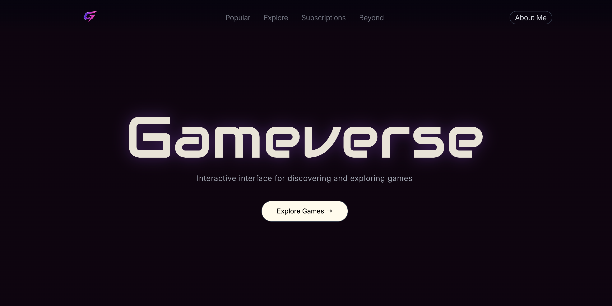
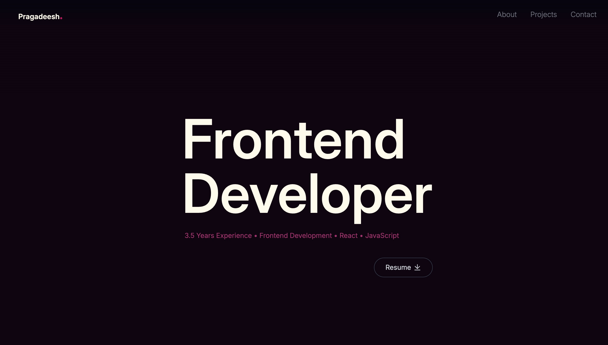

## 🎮 Gameverse App

Gameverse App is a modern React application that combines an interactive gaming platform and a developer portfolio into a single seamless experience. Built with React, JavaScript, Tailwind CSS, Context API, custom Hooks, React Router, and RAWG API integration, the project showcases responsive design, reusable component architecture, dynamic content rendering, and advanced scroll-based UI interactions.

The application consists of two integrated experiences:
• Gameverse – A gaming discovery platform featuring API-driven content, immersive UI interactions, and scroll-based animations.
• Portfolio – A personal developer portfolio highlighting technical skills, experience, and project showcases.

⸻

## 🚀 Live Demo

Gameverse Homepage
##########
Portfolio
##########
⸻

# 📸 Screenshots

### Gameverse Homepage

### Explore Section

### Portfolio Page

⸻

## ✨ Key Features

Gameverse
• API-driven game content using RAWG API
• Route-based architecture using React Router
• Infinite scrolling carousel experience
• Interactive genre exploration
• Custom flip-card animations
• Scroll-driven UI transitions
• Subscription workflow simulation
• Responsive layouts across devices
Portfolio
• Interactive developer portfolio
• Scroll based animations
• Active section tracking
• Project showcase
• Contact section with external links
• Resume integration

⸻

## 🛠 Tech Stack

Frontend
• React
• JavaScript (ES6+)
• Tailwind CSS
State Management
• Context API
• Custom React Hooks
Routing
• React Router
• Route-based Navigation
Data Integration
• REST APIs
• Async Data Fetching
Development Tools
• Git
• GitHub
• Vite

⸻

## 🏗 Architecture Highlights

• Component-driven architecture
• Reusable UI components
• Custom Hooks for navigation and scroll tracking
• Context-based state management
• Route-based application structure
• Custom scroll-driven animation systems
• Responsive design implementation
• Modular folder organization

⸻

## 📱 Responsive Design

Optimized for:
• Mobile Devices
• Tablets
• Laptops
• Desktop Displays

⸻

## ⚙ Installation

Clone the repository:
git clone ########
Install dependencies:
npm install
Create a .env file:
VITE_RAWG_API_KEY=YOUR_API_KEY
Run locally:
npm run dev

⸻

## 📚 What I Learned

• Building scalable React applications
• Designing reusable component systems
• Creating custom Hooks for shared logic
• Managing application state with Context API
• Implementing responsive UI patterns
• Working with external APIs
• Structuring production-ready frontend projects

⸻

## 🔮 Future Improvements

• Authentication & user profiles
• Search and filtering capabilities
• Favorites and watchlists
• Enhanced API integrations
• Performance optimizations

⸻

## 👨‍💻 Author

**Pragadeesh**
Frontend Developer | React Developer
LinkedIn: https://www.linkedin.com/in/pragadeeshr/
GitHub: https://github.com/PragadeeshR11

⸻
